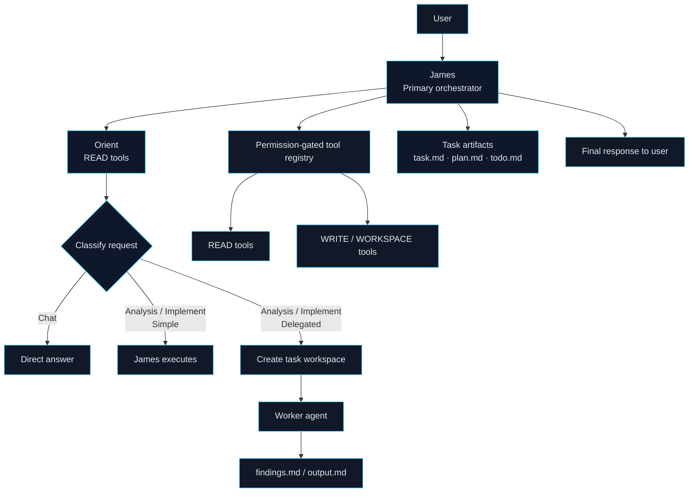
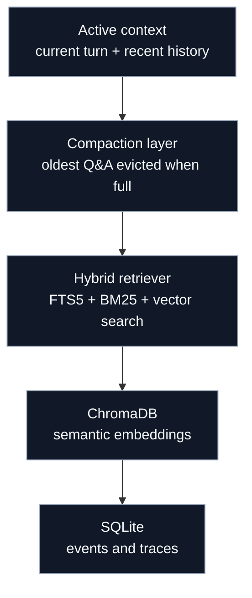

# ACA — Another Coding Agent

<p align="center">
  
  
  
</p>

```text
[bright_cyan bold]
  ░░░░░░  ░░░░░░  ░░░░░
  ██████  ██      ██   ██
  ██████  ██      ███████
  ██  ██  ██      ██   ██
  ██  ██  ██████  ██   ██
[/bright_cyan bold]
[cyan]  ╔══════════════════════════════════════════╗
  ║   A N O T H E R   C O D I N G   A G E N T  ║
  ╚══════════════════════════════════════════╝[/cyan]
[dim]  ⚡  jack in. stay sharp. ship it.[/dim]
```

> ACA is a programmable coding agent framework built around a layered multi-agent architecture. One primary orchestrator, James, classifies requests, routes them, and either handles them directly or delegates the heavy work to subordinate agents.

Think of it as an **agent operating system**: one interface on the outside, a coordinated team of specialized agents on the inside.

---
## What ACA Ships

<table>
  <tr>
    <td width="50%" valign="top">
      <strong>Intelligent routing</strong><br>
      Every request is classified into <strong>Chat</strong>, <strong>Analysis</strong>, or <strong>Implement</strong>, then split into <strong>Simple</strong> or <strong>Delegated</strong> execution.
    </td>
    <td width="50%" valign="top">
      <strong>Layered memory</strong><br>
      Active context, SQLite traces, ChromaDB embeddings, and hybrid retrieval work together so the agent can recover the right history quickly.
    </td>
  </tr>
  <tr>
    <td width="50%" valign="top">
      <strong>Permission-gated tools</strong><br>
      The registry exposes only the tools the agent is allowed to use. READ covers inspection; EDIT unlocks writes, patches, and task workspaces.
    </td>
    <td width="50%" valign="top">
      <strong>Multi-agent execution</strong><br>
      James orchestrates, Worker executes delegated work, and Challenger provides bounded critique before larger moves.
    </td>
  </tr>
  <tr>
    <td width="50%" valign="top">
      <strong>Task workspaces</strong><br>
      Non-trivial work gets a dedicated `.aca/active/&lt;task-id&gt;/` folder with structured artifacts: <code>task.md</code>, <code>plan.md</code>, <code>todo.md</code>, and result files.
    </td>
    <td width="50%" valign="top">
      <strong>Steering and phase control</strong><br>
      Control signals keep routing deterministic, visible, and resumable instead of burying it in hidden agent state.
    </td>
  </tr>
</table>

---

## Architecture


### Memory Layers



<table>
  <tr>
    <td><strong>Active context</strong><br>What James can see right now.</td>
    <td><strong>Compaction</strong><br>Old Q&A pairs are evicted, not lost.</td>
  </tr>
  <tr>
    <td><strong>Hybrid retriever</strong><br>Keyword and vector search merge to recover useful history.</td>
    <td><strong>Durable store</strong><br>SQLite keeps the audit trail and long-term trace data.</td>
  </tr>
</table>

---

## Installation

### Prerequisites

- Python 3.11 or higher
- An OpenRouter API key (or OpenAI-compatible endpoint)

### Setup

```bash
# Clone the repository
git clone https://github.com/yourusername/aca.git
cd aca

# Install dependencies
pip install -e .
# or
pip install -r requirements.txt

# Configure environment
cp .env.example .env
# Then edit .env and add your API key:
# OPENAI_API_KEY=sk-or-v1-xxxxxxxxxxxxxxxxxxxxxxxxxxxxxxxxxxxxxxxxxxxxxxxx
```

### Quick Install

```bash
pip install aca
```

---

## Usage

### Interactive Console

```bash
aca
```

This starts an interactive session where you can chat with James directly.

### Single Prompt

```bash
aca "Explain the agent architecture"
```

### CLI Options

```bash
aca --help
```

| Option | Description |
|--------|-------------|
| `aca` | Start interactive console |
| `aca "prompt"` | Run single prompt and exit |
| `aca --help` | Show help |

---

## Example Session

```
$ aca

  ░░░░░░  ░░░░░░  ░░░░░
  ██████  ██      ██   ██
  ██████  ██      ███████
  ██  ██  ██      ██   ██
  ██  ██  ██████  ██   ██

              Another Coding Agent
              jack in. stay sharp. ship it.

              Type 'exit' to quit.

> What does the agent architecture look like?

James: The ACA system uses a layered multi-agent architecture...
[James provides a detailed explanation]

> Add type hints to load_config in aca/config.py

James: I'll route this to the implementation path.
[James creates a task workspace, writes the task plan,
 and adds type hints directly]

> Analyze the memory system and identify weaknesses

James: This is a wide-scope analysis. I'll delegate this to the Worker agent.
[James creates a task workspace with plan and todo,
 Worker executes and writes findings.md, James reads back results]

Done. See findings above.
```

---

## Project Structure

```
aca/
├── agents/               # Agent implementations
│   ├── base_agent.py     # Abstract base for all agents
│   ├── james.py          # Primary orchestrator
│   ├── worker.py         # Delegated executor
│   ├── challenger.py     # Critique agent
│   └── steering.py       # Phase & routing control
│
├── tools/                # Tool registry & implementations
│   ├── registry.py       # Tool registration & permission gating
│   ├── read.py           # READ-mode tools
│   ├── write.py          # EDIT-mode tools
│   ├── workspace.py      # Task workspace management
│   ├── memory.py         # Memory & retrieval tools
│   └── execution.py      # Execution control tools
│
├── llm/                  # LLM client & providers
│   ├── client.py         # Main LLM interface
│   ├── models.py         # Model definitions
│   └── providers.py      # Provider abstraction
│
├── db.py                 # SQLite database layer
├── cli.py                # CLI entry point
└── console.py            # Interactive console
```

---

## Contributing

Contributions are welcome. Please follow these guidelines:

1. **Fork the repository** and create a feature branch
2. **Write tests** for any new functionality
3. **Follow existing code style** — PEP 8, type hints where possible
4. **Keep scope focused** — one feature or fix per PR
5. **Update docs** if you're changing behavior or adding features

### Running Tests

```bash
pytest tests/
```

### Code Style

```bash
# Format
ruff format .

# Lint
ruff check .
```

---

## Roadmap

- [ ] Spawned sub-agents (frontend, backend, auth agents with `CONTRACTS.md`)
- [ ] Tool call streaming & live output
- [ ] Persistent memory across sessions
- [ ] Built-in evaluation harness
- [ ] Plugin system for custom tools

---

<p align="center">

**ACA** — Built to be programmable, composable, and yours.

*If it saves you time, it worked.*

</p>
